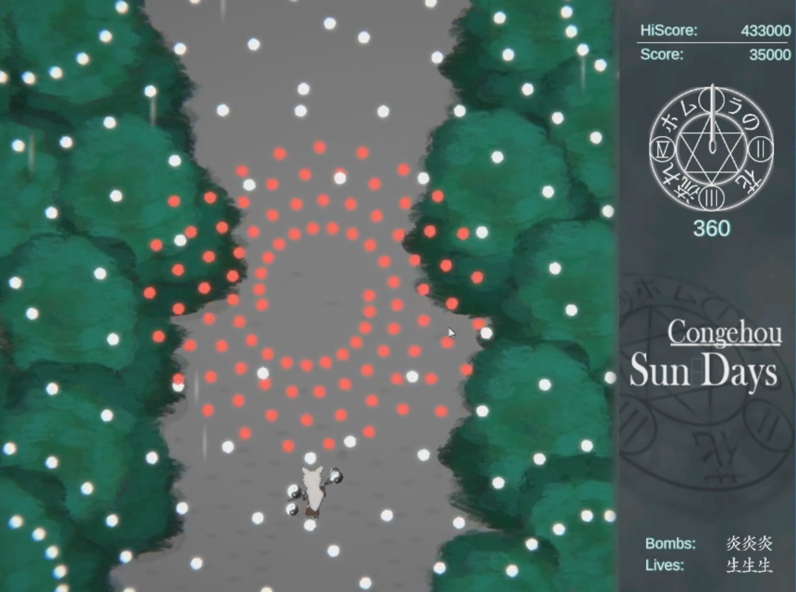

# Congehou-Sun-Days
Made in 10 days to the Bullet Hell Game Jam #1, built on top of the bullet hell game kit also made by me, (do not use it by the way, is far from finished, you can steal the idea if you want) a game inspired by Touhou with the mechanics of the recently launched Touhou Luna Nights, in this game the time is in your advantage. Each bullet behaves differently with the time

This game features 8 minutes of gameplay, 2 bad jokes, bugs and a lot of proud, thanks for playing.

## Images

## How to Play
### Controls

[Z] Homura (Bombs) - A powerful fire attack that incinerates every bullet around you.

[X] Time Stop - Stops the time for a limited amount of time. (Ironic don't you think?)

[Left-Shift] Focus - Hold Left-Shift to slow you down while show your hitbox and the range of Homura.

[P] Infinite Lives. (The game is bit unfair by the end, if you're having trouble, please use this)

### Score System 
 You gain 200 points every 0.5 second for each bullet close to you.

You also gain 2000 points for each bullet destroyed by the Homura.

## Information
### Authors
Programming : Me (Kurenaiz)

Art: Golpelha

Free Assets: --To Include--

### Links
Game Jam Link: https://itch.io/jam/bullethellgamejam1

Itch.io Page: https://kurenaiz.itch.io/congehou-sun-days

### Acknowledgments
* Some scripts were taken from the 2D Gamekit provided by Unity
* Inspired by Touhou
